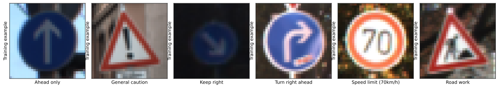
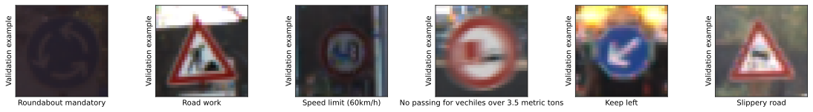
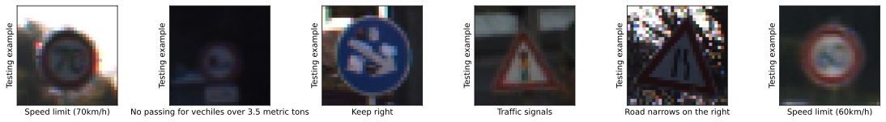
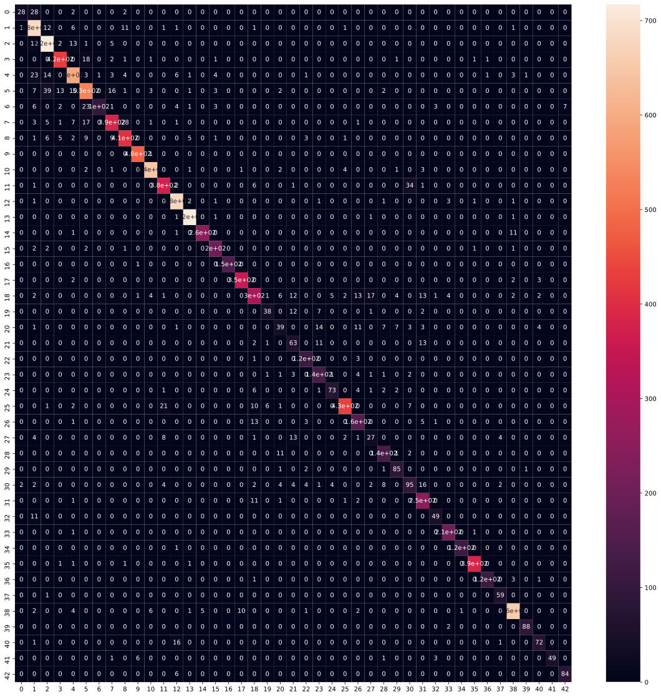
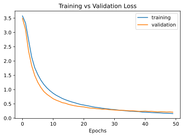
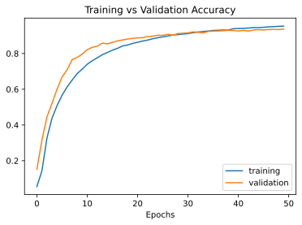

# Traffic Sign Classifier using TensorFlow
>by Parth Mistry

* This classifier will help to classify 43 different Road Signs.   
* In this project, I used Python and Tensorflow to classify the signs.  
* The Dataset is German Traffic Sign (download link is provided below). This dataset contains more than 50,000 images of 43 classes.

## Code and Resources Used  
**Python Version:** 3.7  
**Packages:** numpy, pandas, matplotlib, seaborn, open-cv, keras, tensorflow, pickle  
**Tensorflow Version:** 2.2.0 (GPU Support)   
**Dataset:** [German Traffic Sign](https://bitbucket.org/jadslim/german-traffic-signs/src/master/)

---
## 1. Load the Data
The dataset contains resized 32x32 images. We get three ```.p``` files of those images:  
* ```train.p``` : The training set.
* ```test.p``` : The test set.
* ```valid.p``` : The validation set.

We will use Python ```pickle``` to load the data

---
## 2. Exploration And Summary  
The pickled data is a dictionary with 4 key/value pairs:  
* ```features``` is a 4D array containing raw pixel data of traffic sign images, (num examples, width, height, channels).  
* ```labels``` is a 1D array containing the label of the traffic sign. The file signnames.csv contains id-> mapping for each id.
* ```sizes``` is a list containing tuples, (width and height) representing the original width and height the images.
* ```coords``` is a list containing tuples,(x1,y1,x2,y2) representing coordinates of a bounding box around the sign in the image  

**Firstly we will use ```numpy``` to check the images specifications.**  
There are 34,799 images in the training set, 4,410 in the validation set and 12630 in the test set.
Image Data Shape = (32,32,3).  
Number of classes are = 43  


  

---
## 3. Data Processing  
All the preprocessing tasks will be performed here to get the best outputs.  
We will use the following techniques to preprocess the images:
1. Shuffling: We will shuffle the data to increase the variety and randomness in the training set, this will help the model to increase it's stability. To achieve this we will use  ```shuffle``` from ```sklearn.utils``` to shuffle the data.
2. Grayscaling: As stated in the research paper ["Traffic Sign Recognition with Multi-Scale Convolutional Networks"](http://yann.lecun.com/exdb/publis/pdf/sermanet-ijcnn-11.pdf) published in 2011, by Pierre Sermanet and Yann LeCun that using grayscale images instead of color improves the Convolutional Neural Network's Accuracy. We will use ```cvtColor``` from ```open-cv``` to convert the images to grayscale.
3. Local Histogram Equalization: It spreads out the most frequent itensity values in an image enhancing images with low contrast. Applying this technique will be beneficial as the dataset has real world images with varying contrast. We will use ```equalizeHist``` of ```open-cv``` to equalize the lighting.
4. Normalization: Normalization is a process that changes the pixel intensity values. Usally the image data should be normalized so that the data has   ```mean zero``` and ```equal variance```.  

---
## 4. Model Archietecture
* In this step, we will design and implement a deep learning model that learns to recognize traffic signs from our dataset.  
* For this problem statement we will use Convolutional Neural Networks to classify images in this dataset. The reason behind choosing ConvNets is that they are designed to recognize visual patterns directly from pixel images with minimal processing. They automatically learn hierarchies of invariant features at every level from data.  
* Our goal is to reach an accuracy of +90% on the validation set.  
* This Convolutional Neural Network follows these steps:  
    
    Input => Conv => ReLu => Pooling => Dropout => Conv => ReLu => Pooling => Flatten => FullyConnected => ReLu => DropOut => FullyConnected => SoftMax  

**Layer 1** *Convolutional* : The output shape should be  28x28x32  
**Activation** : ReLu  
**Pooling** : The output shape should be 14x14x32  
**DropOut** : The output shape should be 14x14x32  
**Layer 2** *Convolutional* : The output shape should be 10x10x64  
**Activation** : ReLu  
**Pooling** : The output shape should be 5x5x64  
**Flatten** : Flatten the output shape of the final pooling layer such that it's 1D instead of 3D.  
**Layer 3** *Fully Connected* : This should have 256 outputs  
**Dropout** : This should have 256 outputs  
**Layer 4** *Fully Connected)* : This should have 43 outputs  

### Notes:
* We specify 0.0001 the learning rate, which tells the neural network how quickly to update weights.
* We minimize the loss function using the Adaptive Moment Estimation (Adam) Algorithm. Adam is an optimization algorithm introduced by D. Kingma and J. Lei Ba in a 2015 paper named [Adam: A Method for Stochastic Optimization](https://arxiv.org/abs/1412.6980). Adam algorithm computes adaptive learning rates for each parameter. In addition to storing an exponentially decaying average of past squared gradients like [Adadelta](https://arxiv.org/pdf/1212.5701.pdf) and [RMSprop](https://www.cs.toronto.edu/~tijmen/csc321/slides/lecture_slides_lec6.pdf) algorithms, Adam also keeps an exponentially decaying average of past gradients mtmt, similar to [momentum algorithm](http://www.sciencedirect.com/science/article/pii/S0893608098001166?via%3Dihub), which in turn produce better results.  
* We will use ```Sparce Categorial CrossEntropy``` as the loss function to get output in the form of 43 classes.

---
## 5. Training and Evaluation
* After each epoch, we measure the loss and accuracy of the validation set
* And after training, we will save the model.
* A low accuracy on the training and validation sets imply underfitting. A high accuracy on the training set but low accuracy on the validation set implies overfitting.
### Model
```
Epoch 1/50  loss: 3.5605 - accuracy: 0.0675 - val_loss: 3.4856 - val_accuracy: 0.1510  
Epoch 2/50  loss: 3.2739 - accuracy: 0.1655 - val_loss: 3.0320 - val_accuracy: 0.3304  
Epoch 3/50  loss: 2.6931 - accuracy: 0.3190 - val_loss: 2.3811 - val_accuracy: 0.4261  
Epoch 4/50  loss: 2.1890 - accuracy: 0.4201 - val_loss: 1.9400 - val_accuracy: 0.5057  
Epoch 5/50  loss: 1.8467 - accuracy: 0.4897 - val_loss: 1.6035 - val_accuracy: 0.5726  
Epoch 6/50  loss: 1.5948 - accuracy: 0.5438 - val_loss: 1.3556 - val_accuracy: 0.6408  
Epoch 7/50  loss: 1.4085 - accuracy: 0.5863 - val_loss: 1.1748 - val_accuracy: 0.6986  
Epoch 8/50  loss: 1.2472 - accuracy: 0.6325 - val_loss: 1.0266 - val_accuracy: 0.7329  
Epoch 9/50  loss: 1.1166 - accuracy: 0.6692 - val_loss: 0.9047 - val_accuracy: 0.7683  
Epoch 10/50 loss: 1.0100 - accuracy: 0.6974 - val_loss: 0.8237 - val_accuracy: 0.7769  
Epoch 11/50 loss: 0.9217 - accuracy: 0.7244 - val_loss: 0.7448 - val_accuracy: 0.7995  
Epoch 12/50 loss: 0.8462 - accuracy: 0.7463 - val_loss: 0.6844 - val_accuracy: 0.8234  
Epoch 13/50 loss: 0.7821 - accuracy: 0.7654 - val_loss: 0.6457 - val_accuracy: 0.8279
Epoch 14/50 loss: 0.7334 - accuracy: 0.7802 - val_loss: 0.5984 - val_accuracy: 0.8433  
Epoch 15/50 loss: 0.6823 - accuracy: 0.7960 - val_loss: 0.5677 - val_accuracy: 0.8481  
Epoch 16/50 loss: 0.6372 - accuracy: 0.8102 - val_loss: 0.5299 - val_accuracy: 0.8624
Epoch 17/50 loss: 0.5976 - accuracy: 0.8227 - val_loss: 0.5019 - val_accuracy: 0.8680  
Epoch 18/50 loss: 0.5607 - accuracy: 0.8302 - val_loss: 0.4807 - val_accuracy: 0.8683  
Epoch 19/50 loss: 0.5362 - accuracy: 0.8383 - val_loss: 0.4529 - val_accuracy: 0.8796  
Epoch 20/50 loss: 0.5021 - accuracy: 0.8486 - val_loss: 0.4407 - val_accuracy: 0.8816
Epoch 21/50 loss: 0.4791 - accuracy: 0.8568 - val_loss: 0.4270 - val_accuracy: 0.8839  
Epoch 22/50 loss: 0.4514 - accuracy: 0.8658 - val_loss: 0.4145 - val_accuracy: 0.8853  
Epoch 23/50 loss: 0.4364 - accuracy: 0.8703 - val_loss: 0.3924 - val_accuracy: 0.8955  
Epoch 24/50 loss: 0.4112 - accuracy: 0.8758 - val_loss: 0.3743 - val_accuracy: 0.8982  
Epoch 25/50 loss: 0.3940 - accuracy: 0.8820 - val_loss: 0.3653 - val_accuracy: 0.8971  
Epoch 26/50 loss: 0.3763 - accuracy: 0.8888 - val_loss: 0.3648 - val_accuracy: 0.8957  
Epoch 27/50 loss: 0.3640 - accuracy: 0.8929 - val_loss: 0.3471 - val_accuracy: 0.9009  
Epoch 28/50 loss: 0.3499 - accuracy: 0.8959 - val_loss: 0.3364 - val_accuracy: 0.9059  
Epoch 29/50 loss: 0.3334 - accuracy: 0.9015 - val_loss: 0.3308 - val_accuracy: 0.9061  
Epoch 30/50 loss: 0.3146 - accuracy: 0.9078 - val_loss: 0.3203 - val_accuracy: 0.9098  
Epoch 31/50 loss: 0.3099 - accuracy: 0.9078 - val_loss: 0.3137 - val_accuracy: 0.9120  
Epoch 32/50 loss: 0.2979 - accuracy: 0.9120 - val_loss: 0.3059 - val_accuracy: 0.9118  
Epoch 33/50 loss: 0.2860 - accuracy: 0.9146 - val_loss: 0.2951 - val_accuracy: 0.9156  
Epoch 34/50 loss: 0.2770 - accuracy: 0.9176 - val_loss: 0.2873 - val_accuracy: 0.9170  
Epoch 35/50 loss: 0.2711 - accuracy: 0.9192 - val_loss: 0.2905 - val_accuracy: 0.9159  
Epoch 36/50 loss: 0.2574 - accuracy: 0.9251 - val_loss: 0.2887 - val_accuracy: 0.9141  
Epoch 37/50 loss: 0.2498 - accuracy: 0.9263 - val_loss: 0.2753 - val_accuracy: 0.9193  
Epoch 38/50 loss: 0.2403 - accuracy: 0.9284 - val_loss: 0.2810 - val_accuracy: 0.9161  
Epoch 39/50 loss: 0.2320 - accuracy: 0.9306 - val_loss: 0.2703 - val_accuracy: 0.9209  
Epoch 40/50 loss: 0.2260 - accuracy: 0.9346 - val_loss: 0.2613 - val_accuracy: 0.9234
Epoch 41/50 loss: 0.2156 - accuracy: 0.9380 - val_loss: 0.2590 - val_accuracy: 0.9274
Epoch 42/50 loss: 0.2107 - accuracy: 0.9384 - val_loss: 0.2580 - val_accuracy: 0.9236
Epoch 43/50 loss: 0.2057 - accuracy: 0.9393 - val_loss: 0.2507 - val_accuracy: 0.9277
Epoch 44/50 loss: 0.2016 - accuracy: 0.9398 - val_loss: 0.2508 - val_accuracy: 0.9274
Epoch 45/50 loss: 0.1914 - accuracy: 0.9433 - val_loss: 0.2459 - val_accuracy: 0.9247
Epoch 46/50 loss: 0.1899 - accuracy: 0.9437 - val_loss: 0.2430 - val_accuracy: 0.9281
Epoch 47/50 loss: 0.1865 - accuracy: 0.9452 - val_loss: 0.2433 - val_accuracy: 0.9268
Epoch 48/50 loss: 0.1778 - accuracy: 0.9480 - val_loss: 0.2355 - val_accuracy: 0.9336
Epoch 49/50 loss: 0.1711 - accuracy: 0.9498 - val_loss: 0.2383 - val_accuracy: 0.9331
Epoch 50/50 loss: 0.1615 - accuracy: 0.9527 - val_loss: 0.2271 - val_accuracy: 0.9342
```
* We've been able to reach a maximum accuracy of 93.4% on the validation set over 50 epochs, using a learning rate of 0.0001.

Now, we'll use the testing set to measure the accuracy of the model over unknown examples. We've been able to reach a Test accuracy of **91.8**%.

Now we'll plot the confusion matrix to see where the model actually fails.  

  


We observe some clusters in the confusion matrix above. It turns out that the various speed limits are sometimes misclassified among themselves. Similarly, traffic signs with traingular shape are misclassified among themselves. We can further improve on the model using hierarchical CNNs to first identify broader groups (like speed signs) and then have CNNs to classify finer features (such as the actual speed limit).

---
## Conclusion  
Using the model we created, we are able to reach very high accuracy rate. We can try other model processing techniques to further improve models accuracy. We can further improve on the model using hierarchical CNNs to first identify broader groups (like speed signs) and then have CNNs to classify finer features (such as the actual speed limit) This model will only work on input examples where the traffic signs are centered in the middle of the image. It doesn't have the capability to detect signs in the image corners.

Parth Mistry © 2020